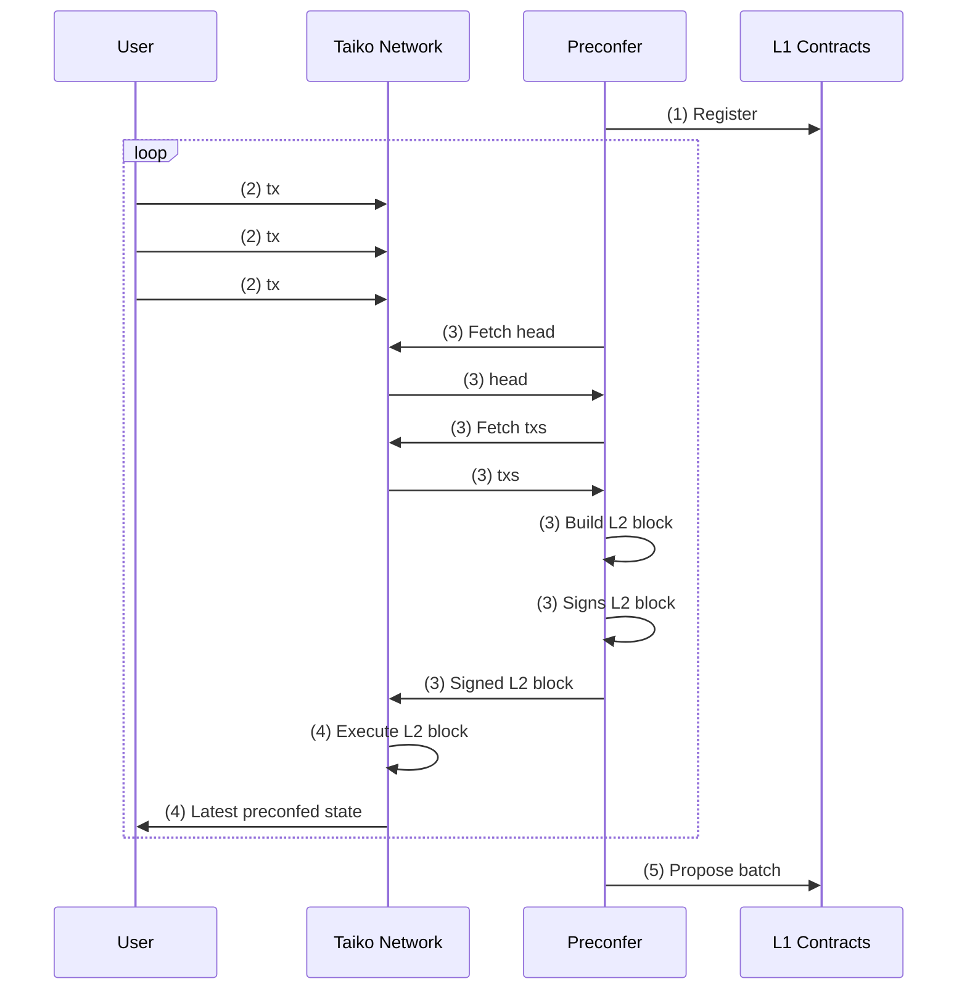

# Taiko  Preconfer
## Overview
The following diagram illustrates the interaction of a preconfer with the taiko network and the underlying L1.

## Development
#### git hooks
Enable git hooks through either
 - copying them from `<REPO_ROOT>/scripts/git` to `<REPO_ROOT>/.git/hooks` or
 - setting the hooks path to `<REPO_ROOT>/scripts/git`, i.e. `git config core.hooksPath <REPO_ROOT>/scripts/git`

The following hooks are available:
 - post-merge: Removes branches that have been deleted on the remote

#### code coverage
To compute test coverage install `cargo-llvm-cov`.
* Install: `cargo install cargo-llvm-cov`
* Run from repo root: `zsh scripts/coverage.sh`
* Display coverage in vscode: Install `Coverage Gutters` extension
